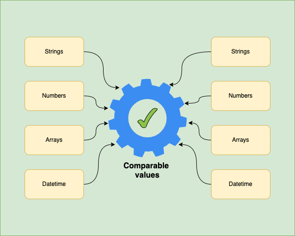

# Comparable values

For certain types you can't make comparisons out of the box in Python but
Validation brings support to a few of them.

<p align="center">

</p>

You can make comparison with the following data types:

- Countable: any object that has attribute `__len__`
- `datetime` objects
- String which can be converted to `datetime` based on ISO format
- Integer types (`int`, `float`, `bool`)
- Single character string
- If string is digit, then it will be treated as integer
- String with more than one character comparable by length

Below you can see some examples:

```python
#  int compare with range
v.Min(100).validate(range(101))  # true if it has at least 100 items
```
```python
#  datetime support
yesterday = datetime.today() - timedelta(days=1)
tomorrow = datetime.today() + timedelta(days=1)
now = datetime.today()

v.dateTime()\
    .between(yesterday, tomorrow)\
    .validate(now)  # true
```
```python
#  int compatible with str
v.digit().Max(10).validate('5')  # true
```
```python
v.stringVal().between('a', 'f').validate('d')  # true
```
```python
v.dateTime().between('2022-04-01', '2022-04-15').validate('2022-04-07 10:12:11')  # true
```