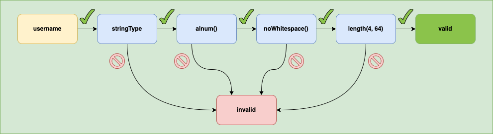

# Overview

### Python version of "[the most awesome validation engine for PHP](https://github.com/Respect/Validation)"

### Installation

```bash
pip install respect-validation
```

### --> [DEMO](/respect_validation/demo.html)

<p align="center">
  
</p>

## General information

PHP and Python have many differences that why this library has some small changes, but an awesome architecture was migrated without changes.

- Complex rules made simple: `v.numericVal().positive().between(1, 255).validate(some_variable)`.
- [Advanced reporting](feature-guide.md#getting-all-messages-as-a-dict) to show validation errors.
- [More than 130](list-of-rules.md) (fully tested) validation rules.
- [Integration with Flask](./flask%20integration/2_simple_flask.md) example.
- Please see [demo of integration with flask](/respect_validation/demo.html).
- [Easy translation](/respect_validation/translation/) with multi-language support.

### Why is it great alternative to others?

- It is easy to make logical check in one line. You __can easily see logic
in chain of rules__. There are no addition classes, instances,
dictionaries, __there is only one chain of rules__ and it is
beautiful.
- There are logical operators inside, you can use them as usual rules.
You can easily set several validation chains and wrap them into
logical rule like `AnyOf` or `OneOf` (only one chain valid) or
`AllOf` or `When` (if ... then ... else) and so on. I hope you will
find this interesting.
- Any rule or chain of rules you can easily revert to negative result
with only one logical rule - `Not`.
- There are many of prebuilt rules. They will be useful for most of
general cases.
- You can easily create you own package of rules and use it when it is
needed.

### How to say thank you?

If you like this library please add star for initial library
"[the most awesome validation engine for PHP](https://github.com/Respect/Validation)".

Many thanks to Alexandre Gomes Gaigalas for beautiful architecture.
